# Opinionated React Front-End Developer Roadmap

**Welcome to the Opinionated React Front-End Developer Roadmap for Beginners**

Congratulations on taking the first step towards launching your career in React front-end development! This repository is designed to serve as your comprehensive guide, equipping you with the necessary skills and knowledge to land your first job in the dynamic world of React.

As a beginner, navigating the vast landscape of web development can feel overwhelming. This roadmap aims to simplify your journey by breaking down the essential steps, resources, and milestones you need to achieve proficiency in React. Whether you're transitioning from another field or starting fresh in the tech industry, this roadmap caters to individuals at various skill levels, offering a structured path towards becoming a competent React front-end developer.

**What You'll Find Here:**

1. **Roadmap:** A step-by-step guide outlining the technologies, tools, and concepts you should master, starting from the fundamentals and progressing towards advanced topics.

2. **Learning Resources:** Each topic includes handpicked tutorials, articles, videos, and online courses to help you delve deeper into the subject.

Remember, this roadmap is a guide, not a rigid set of rules. Feel free to adjust your learning pace and explore additional resources based on your learning style and interests.

We're excited to see you embark on this journey and witness your growth as a React front-end developer.

Good Luck!

## HTML & CSS

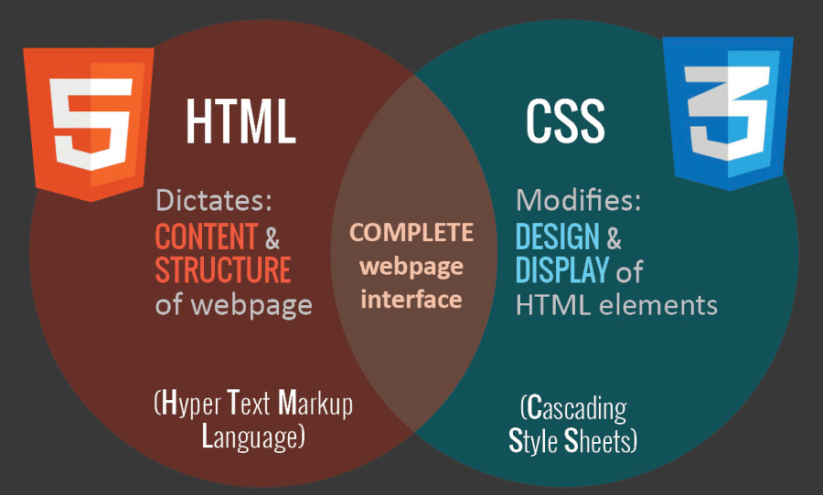

### HTML

HTML stands for HyperText Markup Language. It is the frontend's structural language, using tags to organize webpage content. CSS styles the elements, determining their visual presentation, while JavaScript adds interactivity and dynamic features. Together, they create a cohesive and engaging user experience.

HTML uses a system of tags to define and organize different elements on a webpage, such as headings, paragraphs, images, links, and more. These tags provide a hierarchical structure, allowing browsers to interpret and display the content as intended. Browsers read HTML documents from top to bottom, rendering the content and presenting it to users. HTML serves as the backbone of a webpage, laying the foundation for styling with CSS and interactivity with JavaScript.

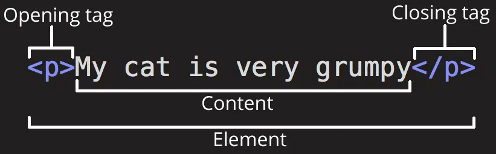

HTML attributes add extra details to elements, influencing their behavior or appearance. Placed in opening tags, they modify aspects like links, image sources, and styles, enhancing the functionality and presentation of webpage elements.

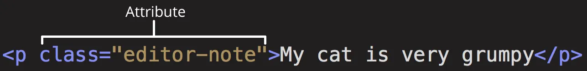

#### HTML - Resources

- [Codecademy - Learn HTML](https://www.codecademy.com/learn/learn-html)
- [Introduction to HTML - Learn web development | MDN](https://developer.mozilla.org/en-US/docs/Learn/HTML/Introduction_to_HTML)
- [Interactive HTML Course](https://github.com/denysdovhan/learnyouhtml)
- [HTML Full Course for Beginners | Complete All-in-One Tutorial](https://youtu.be/mJgBOIoGihA)
- [HTML Full Course - Build a Website Tutorial](https://www.youtube.com/watch?v=pQN-pnXPaVg)

### CSS

CSS, also known as Cascading Style Sheets, is the language dedicated to styling the frontend of websites. It is a fundamental technology of the World Wide Web, working in tandem with HTML and JavaScript.

It uses selectors to target specific elements and declarations to define their appearance. These declarations include properties (like color or font size) and values (specific settings for those properties). CSS can be applied internally within an HTML document, in a separate external stylesheet, or inline directly within HTML tags. The "cascading" nature means that styles can be inherited and overridden, providing a systematic way to control the visual presentation of a webpage.

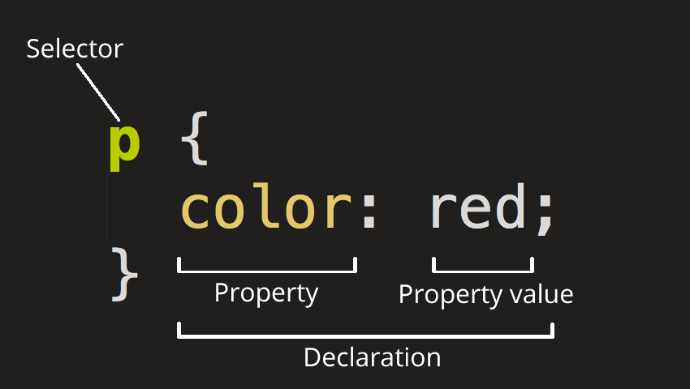

#### CSS - Resources

- [Learn CSS | Codecademy](https://www.codecademy.com/learn/learn-css)
- [CSS first steps overview - Learn web development | MDN](https://developer.mozilla.org/en-US/docs/Learn/CSS/First_steps)
- [Learn Intermediate CSS | Codecademy](https://www.codecademy.com/learn/learn-intermediate-css)
- [CSS Crash Course For Absolute Beginners](https://www.youtube.com/watch?v=yfoY53QXEnI)
- [CSS Masterclass - Tutorial & Course for Beginners](https://www.youtube.com/watch?v=FqmB-Zj2-PA)
- [What The Flexbox!](https://flexbox.io/)

#### Responsive Design

Responsive design in CSS refers to the practice of creating web layouts that adapt and respond to different screen sizes and devices.

The goal is to ensure an optimal viewing experience for users across a range of devices, from desktop computers to tablets and smartphones. Responsive design uses techniques such as fluid grids, flexible images, and media queries to dynamically adjust the layout and styling based on the characteristics of the device.

This approach allows content to be presented in a readable and visually pleasing manner, regardless of the screen size, leading to a more user-friendly and accessible web experience.

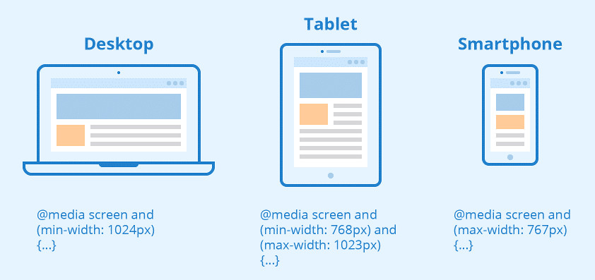

##### Responsive Design - Resources

- [freeCodeCamp — Responsive Web Design](https://www.freecodecamp.org/learn/responsive-web-design/)
- [Code Academy - Learn CSS: Responsive Design](https://www.codecademy.com/learn/learn-responsive-design)

#### SCSS

SCSS, which stands for "Sassy CSS" is a preprocessor scripting language that is interpreted or compiled into Cascading Style Sheets (CSS). It is a superset of CSS, meaning that all valid CSS code is also valid SCSS, but SCSS extends CSS with additional features and capabilities.

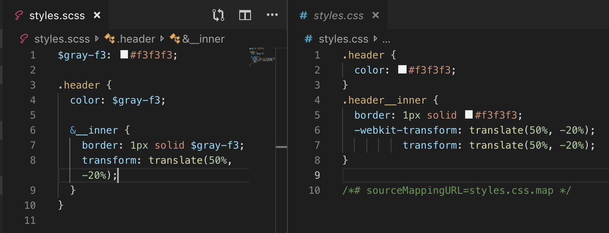

SCSS introduces features like variables, nesting, and mixins, which can significantly improve the efficiency and maintainability of CSS code. Variables allow for the reuse of values, nesting helps create more organized and readable stylesheets, and mixins enable the reuse of sets of CSS declarations.

```scss
$primary-color: #ff0000;
$font-size-large: 20px;

.element {
  color: $primary-color;
  font-size: $font-size-large;
}
```

In summary, SCSS is a powerful extension of CSS, providing additional features to make styling more modular, maintainable, and efficient in web development projects.

##### SCSS - Resources

- [SCSS Website](https://sass-lang.com/)
- [Official Documentation](https://sass-lang.com/documentation)
- [SCSS Tutorial for Beginners](https://www.youtube.com/watch?v=_a5j7KoflTs)

## JavaScript

JavaScript is a programming language initially designed to interact with elements of web pages. In web browsers, JavaScript allows you to add interactivity to a web page. Typically, you use JavaScript with HTML and CSS to enhance a web page’s functionality, such as validating forms, creating interactive maps, and displaying animated charts.

When a web page is loaded, i.e., after HTML and CSS have been downloaded, the JavaScript engine in the web browser executes the JavaScript code. The JavaScript code then modifies the HTML and CSS to update the user interface dynamically.

JavaScript is the third layer of the layer cake of standard web technologies (Two other layers are HTML & CSS).

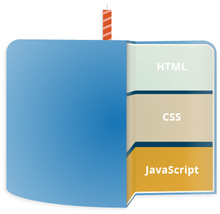

Topics:

- Syntax
- Data types
- Variables
- Operators
- Arrays
- Loops & Iterations
- Control flow statements
- Functions
- Objects
- `this` Variable
- Global Object
- Promises & Async/Await
- Classes
- Error Handling
- Modules
- JavaScript Runtime (Execution Context, Call Stack, Hoisting, Variables Scopes, Event Loop)
- Strict Mode

**JavaScript - Resources:**

- [The Modern JavaScript Tutorial](https://javascript.info/)
- [JavaScript Tutorial](https://www.javascripttutorial.net/)
- [JavaScript First Steps - Learn web development | MDN](https://developer.mozilla.org/en-US/docs/Learn/JavaScript/First_steps)
- [In-Depth JavaScript Tutorials for 2023 | egghead.io](https://egghead.io/q/javascript?access_state=free)
- [Learn Modern Javascript (Build and Test Apps) - Full Course | Udemy](https://www.udemy.com/course/the-complete-javascript-course/)

### The DOM

The Document Object Model (DOM) is a programming interface designed for HTML and XML documents. Representing HTML documents as node trees, the DOM provides functions for efficient addition, removal, and modification of document components.

```html
<!DOCTYPE html>
<html lang="en">
  <head>
    <meta charset="UTF-8" />
    <meta name="viewport" content="width=device-width, initial-scale=1.0" />
    <meta http-equiv="X-UA-Compatible" content="ie=edge" />
    <title>DOM tree structure</title>
  </head>
  <body>
    <h1>DOM tree structure</h1>
    <h2>Learn about the DOM</h2>
  </body>
</html>
```

The HTML code above corresponds to a DOM node tree which can be visualized as follows:

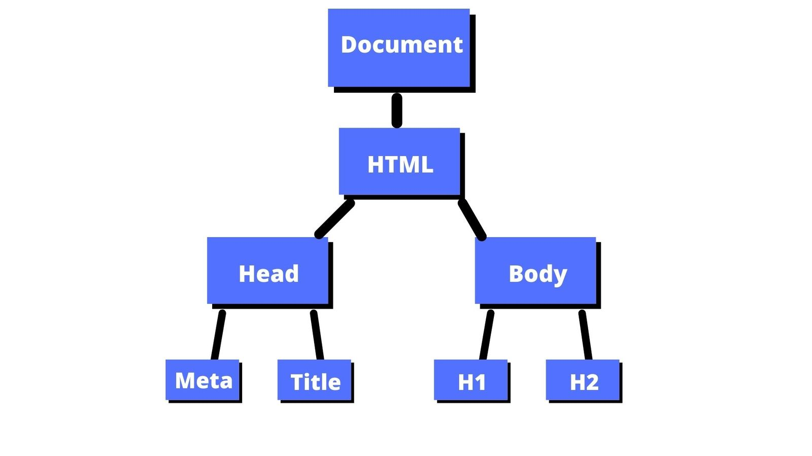

#### DOM Manipulation

When writing web pages and apps, one of the most common things you'll want to do is manipulate the document structure in some way. This is accomplished using the Document Object Model (DOM), a collection of APIs that manage HTML and styling data and rely heavily on the Document object.

Few of the methods & properties used for DOM manipulation (For the full list & documentation check the resources):

- getElementById() - select an element by id.
- getElementsByName() - select elements by name.
- getElementsByClassName() - select elements by a tag name.
- querySelector() - select elements by CSS selectors.
- append() – insert a node after the last child node of a parent node.
- prepend() – insert a node before the first child node of a parent node.
- replaceChild() – replace a child element by a new element.
- cloneNode() – clone an element and all of its descendants.
- removeChild() – remove child elements of a node.
- insertBefore() – insert a new node before an existing node as a child node of a specified parent node.
- insertAfter() helper function – insert a new node after an existing node as a child node of a specified parent node.
- setAttribute() – set the value of a specified attribute on a element.
- getAttribute() – get the value of an attribute on an element.
- removeAttribute() – remove an attribute from a specified element.
- hasAttribute() – check if an element has a specified attribute or not.

#### DOM - Resources

- [The Document Object Model :: Eloquent JavaScript](https://eloquentjavascript.net/14_dom.html)
- [The Modern JavaScript Tutorial](https://javascript.info/#tab-2)
- [DOM tree](https://javascript.info/dom-nodes)
- [What is the DOM? Document Object Model Meaning in JavaScript](https://www.freecodecamp.org/news/what-is-the-dom-document-object-model-meaning-in-javascript/)
- [JavaScript DOM Tutorial](https://www.javascripttutorial.net/javascript-dom/)
- [Manipulating documents - Learn web development | MDN](https://developer.mozilla.org/en-US/docs/Learn/JavaScript/Client-side_web_APIs/Manipulating_documents)
- [What is DOM, Shadow DOM and Virtual DOM?](https://www.youtube.com/watch?v=7Tok22qxPzQ)

## Git, GitHub

### What is a version control system?

Version control, also known as source control, is the practice of tracking and managing changes to software code. Version control systems are software tools that help software developers manage changes to source code over time.

With version control, every change made to the code base is tracked. This allows software developers to see the entire history of who changed what at any given time — and roll back from the current version to an earlier version if they need to. It also creates a single source of truth. It serves as a safety net to protect the source code from irreparable harm, giving the development team the freedom to experiment without fear of causing damage or creating code conflicts.

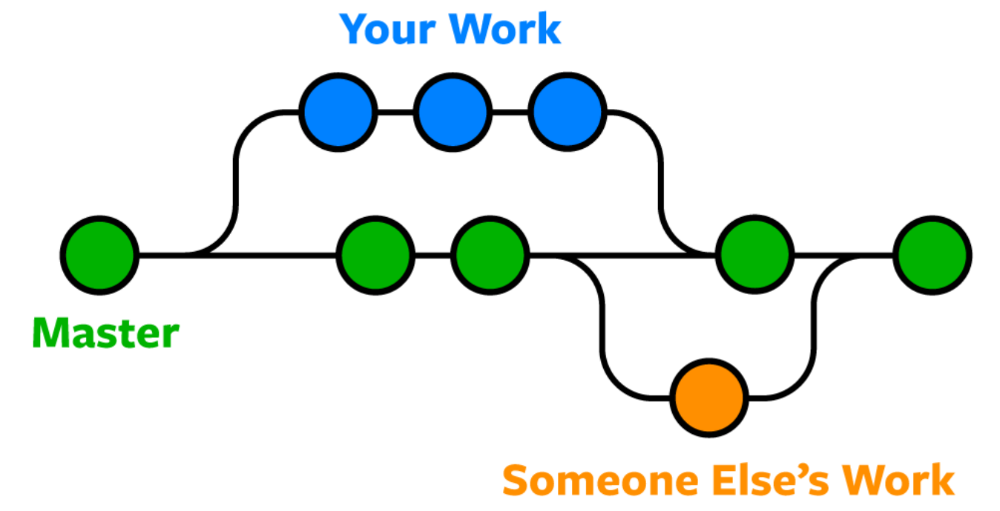

### What is Git?

By far, the most widely used modern version control system in the world today is Git. Git is a mature, actively maintained open source project originally developed in 2005 by Linus Torvalds, the famous creator of the Linux operating system kernel. It's a distributed version control system designed to handle everything from small to very large projects with speed and efficiency.

### Ways to use Git

Git can be used either via a command line (terminal), or via a Graphic User Interface such as the desktop app [GitHub Desktop](https://desktop.github.com/) or the user interface that is included in IDEs & Text Editors such as Visual Studio Code, JetBrains IDEs etc.

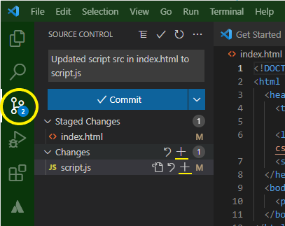

Basic git commands:

```bash
# Initialize a new Git repository
git init

# Clone and create a local copy of a remote repository
git clone <url>

# Show working tree status
git status

# Add files to the staging area
git add <file(s)>

# Commit changes with a message
git commit -m "commit message"

# List all branches
git branch

# Create a new branch
git branch <branch_name>

# Delete a specific branch
git branch -d <branch_name>

# Switch to a specific branch
git checkout <branch_name>

# Merge a branch into the current branch
git merge <branch_name>

# Rebase the current branch onto another branch
git rebase <branch_name>

# List remote repositories
git remote

# Pull changes from a remote branch
git pull <remote_name> <remote_branch>

# Push changes to a remote repository
git push <remote_name> <local_branch>

# Show commit history
git log
```

### What is GitHub?

GitHub allows software developers and engineers to create remote repositories on the cloud for free. A repository, or "repo" for short, is a coding project’s files and the revision history for each file.

Storing a copy of your Git repo with an online host gives you a centrally located place where you can upload your changes and download changes from others, letting you collaborate more easily with other developers. After you have a remote repository set up, you upload (push) your files and revision history to it. After someone else makes changes to a remote repo, you can download (pull) their changes into your local repo.

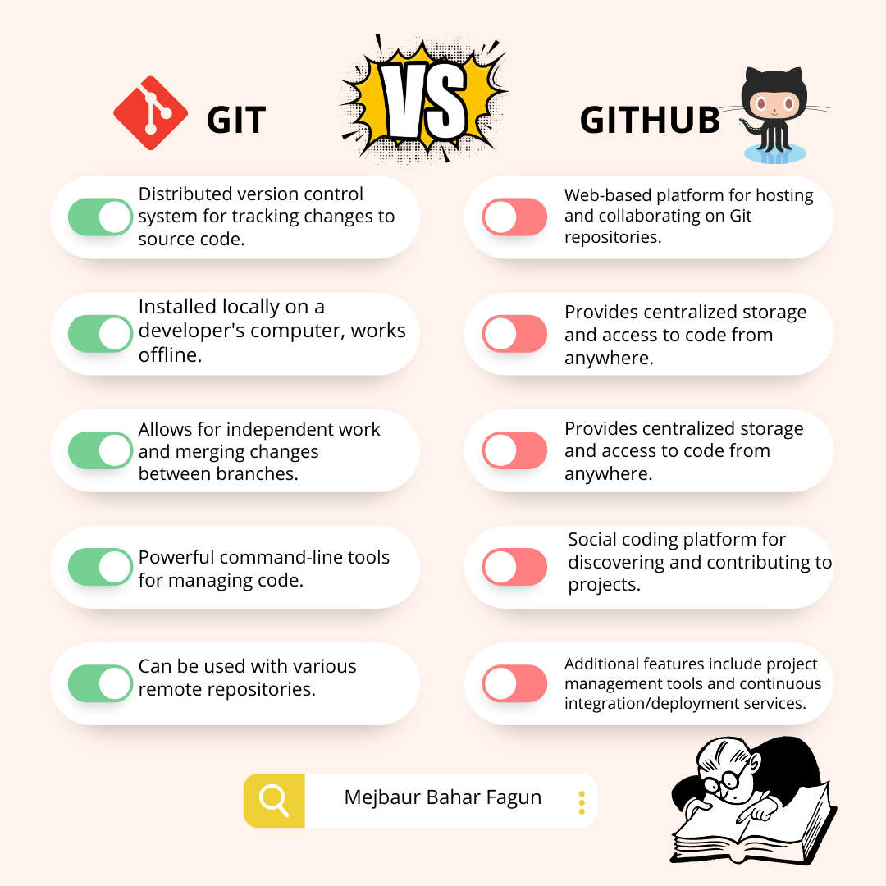

### Git - Resources

- [What is version control | Atlassian Git Tutorial](https://www.atlassian.com/git/tutorials/what-is-version-control)
- [Git & GitHub Crash Course For Beginners](https://www.youtube.com/watch?v=SWYqp7iY_Tc)
- [Learn Git with Tutorials, News and Tips - Atlassian](https://www.atlassian.com/git)
- [Git Cheat Sheet](https://cs.fyi/guide/git-cheatsheet)
- [Tutorial: Git for Absolutely Everyone](https://thenewstack.io/tutorial-git-for-absolutely-everyone/)
- [GitHub Skills](https://skills.github.com/)
- [Git vs. GitHub: What's the difference?](https://www.youtube.com/watch?v=wpISo9TNjfU)

## React

As of 2023, React stands as the most widely employed front-end library in professional web development. Its popularity stems from its efficiency in creating reusable components, facilitating dynamic user interfaces, and optimizing performance through features like the virtual DOM. React's declarative programming model and widespread community support have solidified its position as a go-to choice for building sophisticated and interactive web applications.

State of JS 2022:

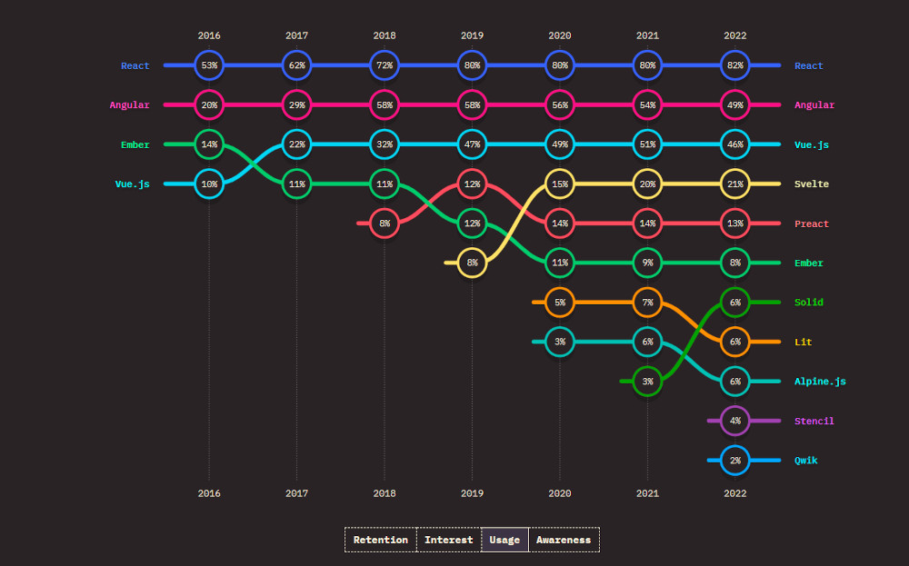

### Components

In React, a component is a modular and reusable piece of code defining a part of a user interface. Components can have their own state, receive data through props, and efficiently update the UI when their state changes. They enable a structured and modular approach to building dynamic web applications.

Components can either be created using the class based approach or a functional approach :

#### Class component

```typescript
import React, { Component } from 'react';
// Class component example

class MyComponent extends Component {
  render() {
    return (
      <div>
        <h1>Hello, {this.props.name}!</h1>
        <p>This is a simple React component.</p>
      </div>
    );
  }
}

export default MyComponent;
```

Although the class components are supported in React, it is encouraged to write **functional components** and make use of hooks in modern React applications.

#### Functional component

```typescript
import React from 'react';

// Functional component example
const MyComponent = (props) => {
  return (
    <div>
      <h1>Hello, {props.name}!</h1>
      <p>This is a simple React component.</p>
    </div>
  );
};

export default MyComponent;
```

**Functional Components - Resources:**

- [Functional Components and Props](https://react.dev/reference/react/Component)
- [Your first component](https://react.dev/learn/your-first-component)
- [Passing props to a component](https://react.dev/learn/passing-props-to-a-component)

### JSX

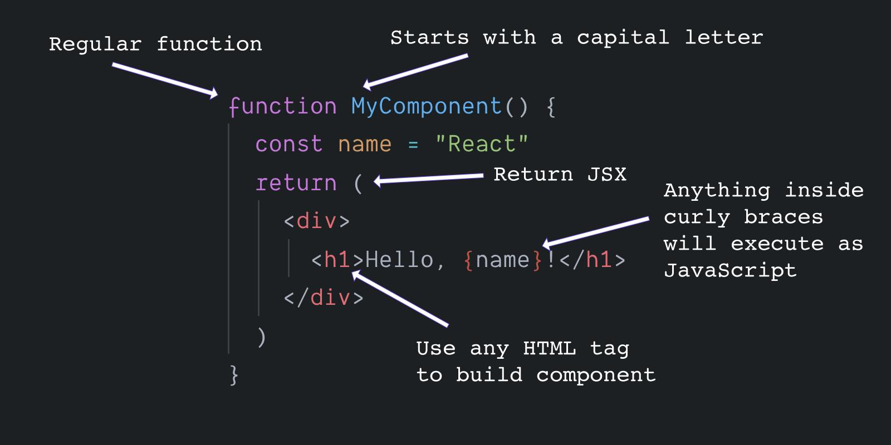

JSX (JavaScript XML) is a syntax extension for JavaScript that allows you to write HTML-like code directly within JavaScript. JSX enables developers to write HTML structures in the same file as their JavaScript logic, thereby promoting a more cohesive development process.

Under the hood, React transforms JSX code into JavaScript, creating React elements that render to the actual DOM. This blending of HTML and JavaScript offers a more intuitive and visual way of developing UIs, as it closely resembles the final output, making the code more readable and maintainable.

**JSX - Resources:**

- [WTF is JSX?](https://egghead.io/learn/react/beginners/wtf-is-jsx)
- [JSX in React – Explained with Examples](https://www.freecodecamp.org/news/jsx-in-react-introduction/)
- [JSX in React on w3school](https://www.w3schools.com/react/react_jsx.asp)

### State

In React, state refers to a built-in feature that allows components to keep track of information over time. Think of it as a snapshot of data that can change in response to user actions, network responses, or other events. When the state of a component changes, React automatically re-renders the component to reflect the latest data. This dynamic and responsive nature of state makes it fundamental in creating interactive and dynamic user interfaces.

To manage state React provide hooks like [`useState`](#usestate)

**State - Resources:**

- [State: A Component’s Memory](https://react.dev/learn/state-a-components-memory)

### Props

Props (short for "properties") are a way of passing data from parent components to child components. They are read-only and allow for the flow of data and configuration options down the component hierarchy. Think of props as the arguments you pass to a function: they let you provide custom values or functionality to a component without the component needing to know the source of that data. This mechanism enables a highly modular and reusable code structure, as components can be designed to behave differently based on the props they receive, yet remain decoupled from their parent components. This is a cornerstone of React's declarative programming style, facilitating the creation of predictable and maintainable user interfaces.

```jsx
// The child component
function Message(props) {
  return <h1>Hello, {props.name}!</h1>;
}

// The parent component
function Greeting() {
  return <Message name='Alice' />;
}

// Usage in an app
function App() {
  return (
    <div>
      <Greeting />
    </div>
  );
}
```

In this example:

- Message is a functional component that takes props as its argument.
- Inside Message, props.name accesses the name property of the props object.
- In the Greeting component, we render Message and pass a prop name with the value "Alice".
- When Greeting is rendered, Message receives the prop and displays "Hello, Alice!"

**Props - Resources:**

- [How to use Props in React](https://www.robinwieruch.de/react-pass-props-to-component/)

### Rendering

After grasping the concept of components in React, it's crucial to delve into rendering. Rendering in React refers to the process of displaying or updating the user interface based on the current state and data.

#### Component Lifecycle

React components have a lifecycle consisting of three phases: **Mounting**, **Updating**, and **Unmounting** along with several “lifecycle methods” that you can override to run code at particular times in the process.

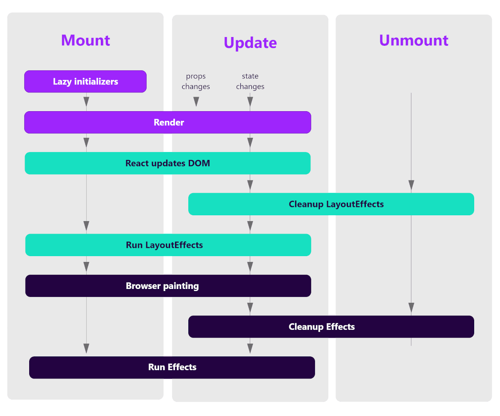

**A good understanding of React components lifecycle is crucial for ensuring that components behave predictably throughout their creation, update, and destruction phases, leading to a more responsive and efficient application.**

**Component Lifecycle - Resources:**

- [React class and hooks lifecycle explained](https://hello-js.com/articles/react-class-and-hooks-lifecycle-explained/)
- [Lifecycle of Reactive Effects](https://react.dev/learn/lifecycle-of-reactive-effects)
- [The Lifecycle of React Hooks Component](https://bhanuteja.dev/the-lifecycle-of-react-hooks-component)

#### Conditional Rendering

In React, it's possible to craft separate components that encapsulate specific functionalities. Subsequently, you have the flexibility to render only select components based on your application's current state.

The process of conditional rendering in React mirrors how conditions are handled in JavaScript. Employ JavaScript operators such as '**if**' statements or the **conditional operator** to construct elements that represent the existing state.

```typescript
import React from 'react';

const ConditionalComponent = ({ isLoggedIn }) => {
  return (
    <div>
      {isLoggedIn ? (
        <p>Welcome, User!</p>
      ) : (
        <p>Please log in to access the content.</p>
      )}
    </div>
  );
};

export default ConditionalComponent;
```

React then takes charge of updating the user interface to align with these conditions, offering a dynamic rendering mechanism. [Different techniques for conditional rendering in React](https://www.robinwieruch.de/conditional-rendering-react/)

-_[Read more](https://www.freecodecamp.org/news/react-under-the-hood/) about what happens behind the scenes_

### Hooks

In React, hooks are functions that enable functional components to use state and other React features that were previously available only in class components. Hooks were introduced in React 16.8 to provide a more direct and concise way to handle state, lifecycle, context, and other features in functional components.

Using **hooks**, functional components can manage state, handle side effects, and access other React features in a concise and readable manner. This makes it easier to write and maintain React code, promoting a more functional and modular approach to component development.

**Hooks - Resources:**

- [Built-in React Hooks – React](https://react.dev/reference/react/hooks)
- [Learn React: Hooks](https://www.codecademy.com/learn/learn-react-hooks)

#### useState

Allows functional components to manage state.

```js
import React, { useState } from 'react';

function Component() {
  // Declare a new state variable, which we'll call "count"
  const [count, setCount] = useState(0);
  return (
    <div>
      <p>You clicked {count} times</p>
      <button onClick={() => setCount(count + 1)}>Click me</button>
    </div>
  );
}
```

#### useEffect

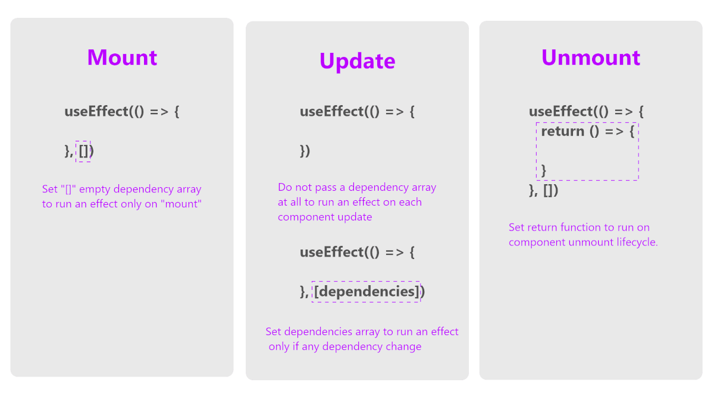

Allows functional components to subscribe to React context without introducing a new component.

```js
import React, { useState, useEffect } from 'react';

function Component() {
  const [count, setCount] = useState(0);

  return (
    <div>
      <p>You clicked {count} times</p>
      <button onClick={() => setCount(count + 1)}>Click me</button>
    </div>
  );
}
```

#### useCallback & useMemo

- `useCallback` memoizes a function, preventing unnecessary re-renders.
- `useMemo` memoizes a value, useful for expensive computations.

```typescript
const memoizedCallback = useCallback(() => {
  doSomething(a, b);
}, [a, b]);
```

```typeScript
const memoizedValue = useMemo(() => computeExpensiveValue(a, b), [a, b]);
```

#### Custom hooks

In the React ecosystem, developers can define their own functions that are prefixed by 'use', signifying their role as hooks. While these custom hooks are not built-in features like useState or useEffect, they play a vital role in enhancing code reusability, readability, and maintainability. This capability is instrumental for developers in creating cleaner, more modular, and easily testable code, especially in the context of larger-scale applications.

Custom hooks are useful for several key reasons:

- Reusability: Custom hooks enable you to extract and reuse logic across different components. For example, if you have a pattern where you fetch data, handle loading, and error states in several components, you can encapsulate this logic in a custom hook and reuse it, reducing code duplication.

- Separation of Concerns: They help in separating the logic from the UI layer. This separation makes your components cleaner and easier to maintain. By abstracting the logic into hooks, your components become more focused on rendering UI, while the hooks handle the functionality.

- Customization: They can accept arguments, allowing for customizable behavior. This means that the same hook can behave differently based on the needs of the component using it.

- Composability: Custom hooks can be composed together to create more complex functionality. You can use multiple custom hooks within a single component or even use a custom hook within another custom hook.

- Simplifying Complex Logic: Complex stateful logic and side effects that are hard to manage in traditional class components become more manageable with custom hooks. They allow you to use more of React's features without classes.

- Testability: Since custom hooks are just functions, they are easier to test compared to class-based components. You can test the logic encapsulated in hooks separately from your component's rendering.

- Community and Sharing: Custom hooks encourage a community-driven approach to solving common problems. Developers can share and use hooks created by others, benefiting from collective knowledge and solutions.

**Example of extracting logic to a custom hook:**

```jsx
// Component without a custom hook
import { useState, useEffect } from 'react';

export default function StatusBar() {
  const [isOnline, setIsOnline] = useState(true);

  useEffect(() => {
    function handleOnline() {
      setIsOnline(true);
    }

    function handleOffline() {
      setIsOnline(false);
    }

    window.addEventListener('online', handleOnline);
    window.addEventListener('offline', handleOffline);

    return () => {
      window.removeEventListener('online', handleOnline);
      window.removeEventListener('offline', handleOffline);
    };
  }, []);

  return <h1>{isOnline ? '✅ Online' : '❌ Disconnected'}</h1>;
}
```

```jsx
import { useState, useEffect } from 'react';

// Custom hook definition
function useOnlineStatus() {
  const [isOnline, setIsOnline] = useState(true);

  useEffect(() => {
    function handleOnline() {
      setIsOnline(true);
    }

    function handleOffline() {
      setIsOnline(false);
    }

    window.addEventListener('online', handleOnline);
    window.addEventListener('offline', handleOffline);

    return () => {
      window.removeEventListener('online', handleOnline);
      window.removeEventListener('offline', handleOffline);
    };
  }, []);

  return isOnline;
}

// Component with the custom hook
function StatusBar() {
  const isOnline = useOnlineStatus();

  return <h1>{isOnline ? '✅ Online' : '❌ Disconnected'}</h1>;
}
```

Resources:

- [Reusing Logic with Custom Hooks – React](https://react.dev/learn/reusing-logic-with-custom-hooks)
- [How to Build Your Own React Hooks: A Step-by-Step Guide](https://www.freecodecamp.org/news/how-to-create-react-hooks/)

### React - Resources

- [WTF is React?](https://egghead.io/learn/react/beginners/wtf-is-react)
- [Is React.js a framework or a toolkit?](https://egghead.io/learn/react/toolkit-or-framework)
- [The Beginner's Guide to React | egghead.io](https://egghead.io/courses/the-beginner-s-guide-to-react)
- [Quick Start – React](https://react.dev/learn)
- [React Reference Overview – React](https://react.dev/reference/react)
- [Full Modern React Tutorial](https://www.classcentral.com/course/youtube-full-modern-react-tutorial-45814)
- [Learn React](https://www.classcentral.com/course/scrimba-learnreact-86267)
- [Modern React with Redux [2023 Update]](https://www.udemy.com/course/react-redux/)

YouTube Content Creators To Follow:

- [ByteGrad](https://www.youtube.com/@ByteGrad)
- [Web Dev Simplified](https://www.youtube.com/@WebDevSimplified)
- [Cosden Solutions](https://www.youtube.com/@cosdensolutions)

## Tooling

### Package manager

A package manager is a software that installs and manages third-party packages. Additionally, a package manager has the capability to help developers with managing their shared code in monorepos and creating simple, accessible commands in their projects.

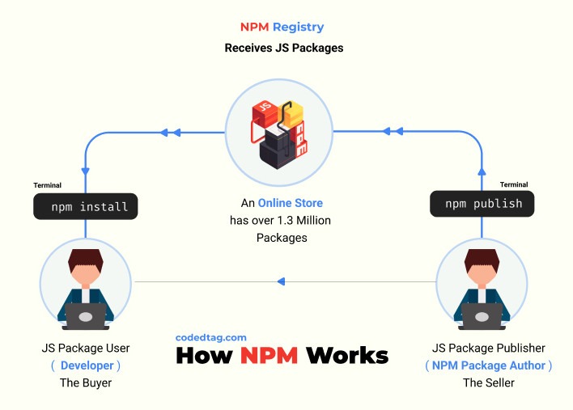

Most used node package managers:

- npm (default package manager included with Node.js)
- Yarn
- pnpm

#### Package Manager - Resources

- [Node Package Managers in 2022 | Viget](https://www.viget.com/articles/node-package-managers-in-2022/)
- [NPM Crash Course](https://www.youtube.com/watch?v=jHDhaSSKmB0)
- [Yarn Package Manager Crash Course](https://www.youtube.com/watch?v=g9_6KmiBISk)
- [Getting Started | Yarn](https://classic.yarnpkg.com/en/docs/getting-started)
- [An Absolute Beginner's Guide to Using npm - NodeSource](https://nodesource.com/blog/an-absolute-beginners-guide-to-using-npm/)

### Eslint

ESLint is an open source JavaScript linting utility originally created by Nicholas C. Zakas in June 2013. Code linting is a type of static analysis that is frequently used to find problematic patterns or code that doesn’t adhere to certain style guidelines. There are code linters for most programming languages, and compilers sometimes incorporate linting into the compilation process.

JavaScript, being a dynamic and loosely-typed language, is especially prone to developer error. Without the benefit of a compilation process, JavaScript code is typically executed in order to find syntax or other errors. Linting tools like ESLint allow developers to discover problems with their JavaScript code without executing it.

ESLint is written using Node.js to provide a fast runtime environment and easy installation via npm.

#### Eslint Resources

- [ESLint: What, Why, When, How - DEV Community](https://dev.to/shivambmgupta/eslint-what-why-when-how-5f1d)
- [ESLint Quickstart - find errors automatically](https://www.youtube.com/watch?v=qhuFviJn-es)
- [5 Reasons to IMMEDIATELY Turn On ESLint in VS Code](https://www.youtube.com/watch?v=KCHg9f2B1I8)
- [Getting Started with ESLint - ESLint - Pluggable JavaScript Linter](https://eslint.org/docs/latest/use/getting-started)
- [About - ESLint - Pluggable JavaScript Linter](https://eslint.org/docs/latest/about/)

### Prettier

Prettier is an opinionated code formatter with support for JavaScript, HTML, CSS, YAML, Markdown, GraphQL Schemas. By far the biggest reason for adopting Prettier is to stop all the on-going debates over styles.


#### Prettier - Resources

- [Why Prettier? · Prettier](https://prettier.io/docs/en/why-prettier.html)
- [How To Setup Prettier](https://www.youtube.com/watch?v=DqfQ4DPnRqI)
- [Prettier · Opinionated Code Formatter](https://prettier.io/)

## TypeScript

TypeScript is a programming language developed by Microsoft that builds on JavaScript. It adds static typing, which means you define the types of variables, function parameters, and object properties. This helps to catch errors early in the development process, making your code more robust and maintainable.

TypeScript is a superset of JavaScript, so any valid JavaScript code is also valid TypeScript. It's designed to help developers manage larger codebases and make JavaScript development more efficient. When TypeScript code is compiled, it turns into plain JavaScript, making it compatible with any browser or JavaScript environment.

let's look at a simple example to illustrate the difference between JavaScript (JS) and TypeScript (TS). We'll use a function that adds two numbers.

**JavaScript Example:**

```js
function add(a, b) {
  return a + b;
}

console.log(add(5, 10)); // Outputs: 15
console.log(add('5', '10')); // Outputs: "510"
```

In JavaScript, the add function takes two parameters a and b. There's no type enforcement, so you can pass numbers, strings, or any other type, leading to potentially unexpected behavior (like concatenating strings instead of adding numbers).

**TypeScript Example:**

```ts
function add(a: number, b: number): number {
  return a + b;
}

console.log(add(5, 10)); // Outputs: 15
console.log(add('5', '10')); // Error: Argument of type 'string' is not assignable to parameter of type 'number'.
```

In TypeScript, we explicitly define the types of the parameters a and b as numbers. TypeScript will check the types at compile time and throw an error if you try to pass anything other than numbers. This type checking helps catch errors early, making the code more reliable and easier to debug.

This example highlights TypeScript's key feature: static type checking, which isn't present in plain JavaScript.

### TypeScript Resources

- [Courses from Kent C. Dodds](https://egghead.io/courses/up-and-running-with-typescript)
- [TypeScript Course for Beginners - Learn TypeScript from Scratch! - YouTube](https://www.youtube.com/watch?v=BwuLxPH8IDs)
- [TypeScript Tutorial](https://www.tutorialspoint.com/typescript/index.htm)
- [Learn Typescript tutorial - 3-hour interactive tutorial](https://scrimba.com/learn/typescript)
- [What Is Typescript? | The New Stack](https://thenewstack.io/what-is-typescript/)
- [TypeScript Tutorial: Go beyond 'Hello, World!' - The New Stack](https://thenewstack.io/typescript-tutorial-go-beyond-hello-world/)
- [TypeScript Tutorial: A Guide to Using the Programming Language - The New Stack](https://thenewstack.io/typescript-tutorial-a-guide-to-using-the-programming-language/)

## Testing

React testing involves verifying that your React components and application behave as expected. There are several testing libraries and tools in the React ecosystem that you can use to write and run tests. One popular testing library is Jest, and another commonly used library for testing React applications is React Testing Library.

### Jest

Jest is an enjoyable JavaScript Testing Framework designed for simplicity. It is compatible with projects utilizing various technologies such as Babel, TypeScript, Node, React, Angular, Vue, and more!

#### Core concepts

1. **Matchers**: Jest provides a variety of matchers (e.g., `expect(value).toBe(expected)`) to make it easy to express expected outcomes in your tests.

2. **Mocking**: Jest allows you to mock functions or modules, enabling you to isolate the code you're testing from external dependencies.

3. **Snapshot Testing**: Jest supports snapshot testing, where it captures the output of a component and compares it against a stored snapshot. This helps catch unintended changes in your UI.

4. **Asynchronous Testing**: Jest simplifies testing asynchronous code by providing utilities to handle promises, timers, and other asynchronous operations.

5. **Coverage Reports**: Jest can generate code coverage reports, showing which parts of your codebase are covered by tests and which are not.

6. **Integration with React**: Jest works seamlessly with React applications and is often used in conjunction with tools like React Testing Library for a more effective testing experience.

#### Jest - Resources

- [Jest Documentation](https://jestjs.io/docs/getting-started)
- [Getting started with Jest using TypeScript | egghead.io](https://egghead.io/lessons/typescript-getting-started-with-jest-using-typescript)
- [JavaScript Testing with Jest – Crash Course](https://www.youtube.com/watch?v=IPiUDhwnZxA)

### React Testing Library

React Testing Library operates by providing a set of utilities that facilitate the testing of React components in a way that mirrors how users interact with the actual application.

The library offers functions for rendering components, querying the resulting DOM, and interacting with the elements as a user would.

**Example:**

```js
// Button.test.js
import React from 'react';
import { render, screen, fireEvent } from '@testing-library/react';
import Button from './Button';

test('Button component renders correctly', () => {
  // Render the Button component
  render(<Button label='Click me' onClick={() => {}} />);

  // Check if the button element is present
  const buttonElement = screen.getByText('Click me');
  expect(buttonElement).toBeInTheDocument();
});

test('Button click event is handled correctly', () => {
  // Mock a function for the onClick event
  const mockClickHandler = jest.fn();

  // Render the Button component with the mock function
  render(<Button label='Click me' onClick={mockClickHandler} />);

  // Find the button element
  const buttonElement = screen.getByText('Click me');

  // Simulate a button click
  fireEvent.click(buttonElement);

  // Check if the mock function was called
  expect(mockClickHandler).toHaveBeenCalled();
});
```

#### React Testing Library - Resources

- [React Testing Library](https://testing-library.com/docs/react-testing-library/intro/)
- [How to use React Testing Library](https://www.robinwieruch.de/react-testing-library/)
- [Learn React Testing](https://www.codecademy.com/learn/learn-react-testing)

## Next.js

Next.js is a popular framework for building web applications using React. It offers features that make building web applications more efficient, especially for more complex projects.

Some key aspects of Next.js include:

- **Server-Side Rendering (SSR)**: Next.js allows pages to be rendered on the server, which can improve performance and SEO. This means the HTML is generated on the server for each request, leading to faster page loads compared to traditional client-side rendering in React.

- **Static Site Generation (SSG)**: Next.js also supports generating static websites from React components. This means you can build sites that are pre-rendered and served as static HTML, which is great for performance and SEO.

- **File-based Routing**: Next.js uses a file-system-based routing mechanism. Pages are automatically routed based on their file names in the pages directory. This makes setting up and understanding routes in your application straightforward.

- **Zero Configuration**: Next.js aims to be easy to set up with minimal configuration required. This allows developers to focus more on writing their application rather than setting up build configurations.

- **Enhanced Developer Experience**: It includes features like hot code reloading, which automatically refreshes your application when you make changes to the code, making the development process smoother.

### Next.js - Resources

- [Learn Next.js – A free video course on React and Next.js.](https://masteringnextjs.com/)
- [Docs | Next.js](https://nextjs.org/docs)
- [Fundamental Next.js API and Patterns | egghead.io](https://egghead.io/courses/fundamental-next-js-api-and-patterns-a6a7509f)
- [Next.js React Framework Course – Build and Deploy a Full Stack App From scratch - YouTube](https://www.youtube.com/watch?v=KjY94sAKLlw)

## React Query

React Query is a powerful library for managing server state in React applications. It's primarily used for fetching, caching, and updating data in your React applications without having to touch the global state management systems like Redux or Context API. Here are some key features and benefits it provides:

- **Automated Fetching**: React Query automates the fetching and refetching of data from APIs, handling the loading states and data freshness. It does this by providing hooks like useQuery for fetching data and useMutation for performing create, update, or delete operations.

- **Caching and Synchronization**: The library automatically caches responses and provides a consistent way to access the cached data across components. This reduces the need for redundant data fetching and ensures that your UI is synchronized with the server state.

- **Background Fetching and Updating**: React Query performs background data fetching and updating, ensuring the UI data is always fresh without manual intervention.

- **Optimistic Updates**: For a better user experience, React Query supports optimistic updates. When a user performs an action, the UI can be updated immediately, before the server response is received, making the app feel more responsive.

- **Automatic Refetching**: React Query intelligently refetches data when there are changes in the app's focus, network status, or query keys, keeping the data up-to-date.

- **Pagination and Infinite Queries**: It simplifies the implementation of complex features like pagination and infinite scrolling with built-in support and hooks.

- **Devtools Integration**: React Query comes with dedicated devtools which make it easier to visualize and debug the state of queries and mutations.

Overall, React Query streamlines the process of fetching, caching, and updating data in React applications, making it a go-to solution for server state management, leading to cleaner code and a more efficient development process.

### React-Query Resources

- [Practical React Query | TkDodo's blog](https://tkdodo.eu/blog/practical-react-query)
- [Overview | TanStack Query Docs](https://tanstack.com/query/latest/docs/react/overview)
- [React Query in 100 Seconds - YouTube](https://www.youtube.com/watch?v=novnyCaa7To)
